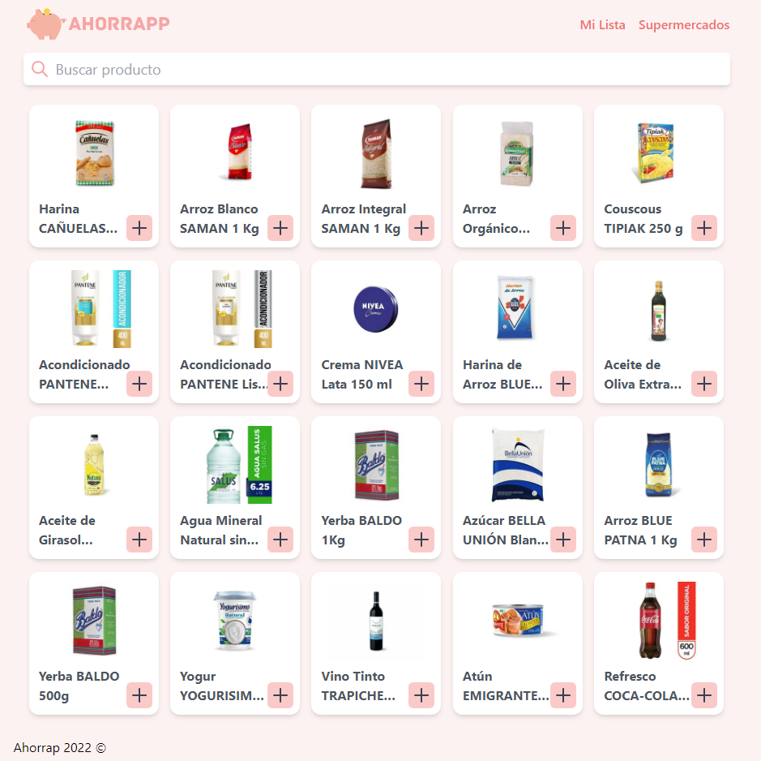
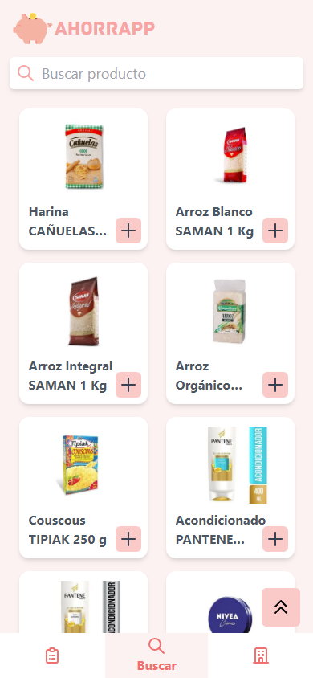

#  Ahorrapp

HOST: www.ahorrapp.me


## Front-end Nuxtjs + Cypress Tests

## Synopsis
This is the MVP project for Holberton. We are using Nuxt.js for the Front-End and Django & SQLite for the Back-end, to test we are using Cypress & Django tests.

## Table of Contents
* [Screenshots](#screenshots)
* [Environment](#environment)
* [File Descriptions](#file-descriptions)
* [Build Setup](#build-setup)
* [Authors](#authors)


## Screenshots

 

## Environment
This project is interpreted/tested on Ubuntu 14.04 LTS using python3 (version 3.4.3), Nuxt.js (^2.15.8).

## File Descriptions
* `back-end` - Back-end api
* `front-end` - Front-end app
* `landing-page` - Landing page of project

## Build Setup

working directory: front-end/

### Install dependencies
`$ yarn install`

### Serve with hot reload at localhost:3000
`$ yarn dev`

### Build for production and launch server
```
$ yarn build
$ yarn start
```

### Test Cypress
```
$ yarn build
$ yarn start
$ yarn cypress open
```


# Back-end Django
Final project MVP base created with Django

## Build Setup

### Install Django
`$ pip install Django`
`$ pip install djangorestframework`
`$ pip install django-cors-headers`
### How to run server
In the manage.py folder run <br>
`$ python3 manage.py runserver`
### Check through browser
localhost:8000 or http://127.0.0.1:8000/
### Admin panel
localhost:8000/admin or http://127.0.0.1:8000/admin

### Run Tests

`$ python3 manage.py test`


## Authors

- Bruno	Rodriguez - Front-end - [Github](https://github.com/brunonra-dev)
- Matias	López - Project Management/Devops - [Github](https://github.com/Matilop15)
- Angel	Piva - Back-end - [Github](https://github.com/AngelPiva)
- Sahin	Meric - Back-end - [Github](https://github.com/sahinmeric)

